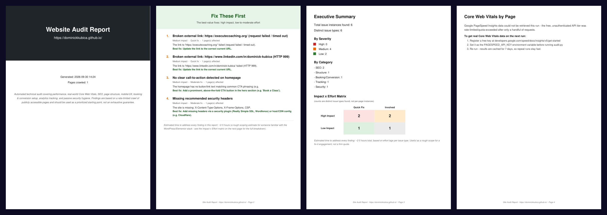

<p align="center">
  
</p>

<p align="center">
  
  
  
  
</p>

Cold outreach to a small business works better when you open with something useful. This tool crawls
a business's website, finds what's costing them customers, and turns it into a clean, prioritized
PDF report. Handing an owner a report about *their* site starts a very different conversation than a
generic pitch.

It has two modes: **report** for a deep audit of one site, and **screen** for triaging hundreds of
prospects to decide who to contact first.

<p align="center">
  
  <br><sub>The first pages of <a href="docs/sample_report.pdf">a sample report</a>, run against my own portfolio site.</sub>
</p>

## What it checks

| Area | Examples |
|---|---|
| **Performance** | Real-world Core Web Vitals (LCP, CLS, INP) from Google PageSpeed Insights, oversized images, CSS bloat |
| **SEO** | Titles, meta descriptions, headings, `robots.txt`, XML sitemap, broken internal and external links |
| **Structure** | Page builder bloat, duplicated headers and menus, orphaned pages |
| **Mobile and UX** | Missing viewport tag, fixed pixel widths that break on phones |
| **Booking and conversion** | Whether there's a clear call to action and a working way to book |
| **Tracking** | Google Tag Manager and GA4 present or missing |
| **Security hygiene** | HTTPS, certificate validity, recommended security headers (passive checks only) |

Every finding comes with why it matters, how to fix it, an impact rating, and an effort rating. The
report opens with a **Fix These First** page (high impact, low effort) and an **Impact × Effort
matrix**, and it ends with a rough hours estimate. That estimate scopes the paid engagement.

## Report mode

```bash
python audit.py report --url https://example.com
```

Crawls up to 50 internal pages from the homepage, respects `robots.txt`, rate-limits itself to about
one request per second, and identifies itself honestly in its User-Agent. Output goes to
`site_audit_report_<domain>_<date>.pdf`, so a report you've already sent is never overwritten.

## Screen mode

```bash
python audit.py screen --csv prospects.csv --out results.csv [--psi]
```

Checks the homepage only, with no crawl and no PDF, and ranks every business in the CSV by how many
problems its site has. When a prospect has no website listed, the Google Places API looks it up, with
a cache and a hard cap on billable lookups. Each output row includes the detected platform (WordPress,
Wix, Squarespace, and so on) and a confidence score, so you can pitch the right fix.

## Setup

```bash
python -m venv venv
venv\Scripts\activate          # macOS/Linux: source venv/bin/activate
pip install -r requirements.txt
```

Both keys are optional and read from the environment:

| Variable | Used for |
|---|---|
| `PAGESPEED_API_KEY` | Core Web Vitals. Without it, Google's unauthenticated tier is heavily rate-limited. [Get a free key](https://developers.google.com/speed/docs/insights/v5/get-started) |
| `PLACES_API_KEY` | Screen mode's website lookup. Falls back to `PAGESPEED_API_KEY` |

## Data handling

Prospect lists, screening results, crawl checkpoints, and API caches all contain third-party business
data or private outreach tracking. `.gitignore` keeps every one of them out of the repository by design.
